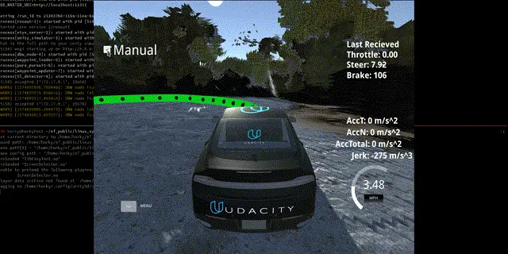
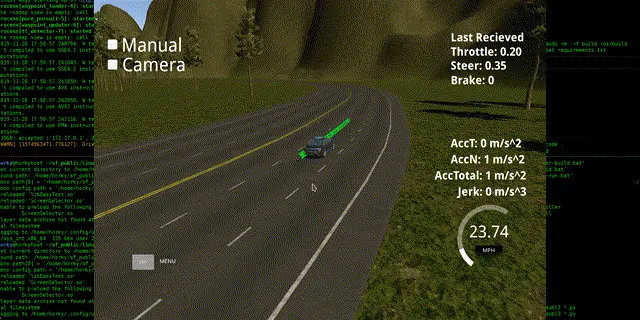

# Team

|Author|E-Mail|
|-|-|
|Ivan Zvonimir Horvat|ivanzvonimirhovat@gmail.com|

This is the project repo for the final project of the Udacity Self-Driving Car Nanodegree: Programming a Real Self-Driving Car. For more information about the project, see the project introduction [here](https://classroom.udacity.com/nanodegrees/nd013/parts/6047fe34-d93c-4f50-8336-b70ef10cb4b2/modules/e1a23b06-329a-4684-a717-ad476f0d8dff/lessons/462c933d-9f24-42d3-8bdc-a08a5fc866e4/concepts/5ab4b122-83e6-436d-850f-9f4d26627fd9).

Please use **one** of the two installation options, either native **or** docker installation.

### Native Installation

* Be sure that your workstation is running Ubuntu 16.04 Xenial Xerus or Ubuntu 14.04 Trusty Tahir. [Ubuntu downloads can be found here](https://www.ubuntu.com/download/desktop).
* If using a Virtual Machine to install Ubuntu, use the following configuration as minimum:
  * 2 CPU
  * 2 GB system memory
  * 25 GB of free hard drive space

  The Udacity provided virtual machine has ROS and Dataspeed DBW already installed, so you can skip the next two steps if you are using this.

* Follow these instructions to install ROS
  * [ROS Kinetic](http://wiki.ros.org/kinetic/Installation/Ubuntu) if you have Ubuntu 16.04.
  * [ROS Indigo](http://wiki.ros.org/indigo/Installation/Ubuntu) if you have Ubuntu 14.04.
* [Dataspeed DBW](https://bitbucket.org/DataspeedInc/dbw_mkz_ros)
  * Use this option to install the SDK on a workstation that already has ROS installed: [One Line SDK Install (binary)](https://bitbucket.org/DataspeedInc/dbw_mkz_ros/src/81e63fcc335d7b64139d7482017d6a97b405e250/ROS_SETUP.md?fileviewer=file-view-default)
* Download the [Udacity Simulator](https://github.com/udacity/CarND-Capstone/releases).

### Bugfixes!!!

* [314 SteeringReport object has no attribute 'steering_wheel_angle_cmd](https://github.com/udacity/CarND-Capstone/issues/314)

Due to unavailability of (DBW_MKZ_MSGS v1.1.1) in Ubuntu repository, I fixed by adding manually older version in [repo](https://github.com/Horki/CarND-Capstone/tree/master/ros/src/dbw_mkz_msgs).

* [317 Camera checkbox error in styx/bridge](https://github.com/udacity/CarND-Capstone/issues/317)

When I turn on camera checkbox in a simulator I have error:

```bash
message handler error
Traceback (most recent call last):
  File "/usr/local/lib/python2.7/dist-packages/engineio/server.py", line 544, in _trigger_event
    return self.handlers[event](*args)
  File "/usr/local/lib/python2.7/dist-packages/socketio/server.py", line 509, in _handle_eio_message
    self._handle_event(sid, pkt.namespace, pkt.id, pkt.data)
  File "/usr/local/lib/python2.7/dist-packages/socketio/server.py", line 448, in _handle_event
    self._handle_event_internal(self, sid, data, namespace, id)
  File "/usr/local/lib/python2.7/dist-packages/socketio/server.py", line 451, in _handle_event_internal
    r = server._trigger_event(data[0], namespace, sid, *data[1:])
  File "/usr/local/lib/python2.7/dist-packages/socketio/server.py", line 480, in _trigger_event
    return self.handlers[namespace][event](*args)
  File "/capstone/ros/src/styx/server.py", line 60, in image
    bridge.publish_camera(data)
  File "/capstone/ros/src/styx/bridge.py", line 183, in publish_camera
    image_message = self.bridge.cv2_to_imgmsg(image_array, encoding="rgb8")
  File "/opt/ros/kinetic/lib/python2.7/dist-packages/cv_bridge/core.py", line 248, in cv2_to_imgmsg
    img_msg.height = cvim.shape[0]
IndexError: tuple index out of range
```

* This was fixed by upgrading Pillow to newer version (ex.: v6.2.1)*

```bash
 pip install pillow==6.2.1
```

### Docker Installation

[Install Docker](https://docs.docker.com/engine/installation/)

Build the docker container

```bash
docker build . -t capstone
```

Run the docker file

```bash
docker run -p 4567:4567 -v $PWD:/capstone -v /tmp/log:/root/.ros/ --rm -it capstone
```

### Port Forwarding

To set up port forwarding, please refer to the "uWebSocketIO Starter Guide" found in the classroom (see Extended Kalman Filter Project lesson).

### Usage

1. Clone the project repository

```bash
git clone https://github.com/Horki/CarND-Capstone.git
```

2. Install python dependencies

```bash
cd CarND-Capstone
pip install -r requirements.txt
# Also update Pillow, due to some issues
pip install pillow --upgrade
```

3. Make and run styx

```bash
cd ros
catkin_make
# Or build a release version
# catkin_make -DCMAKE_BUILD_TYPE=Release
source devel/setup.sh
roslaunch launch/styx.launch
```

4. Run the simulator

### Real world testing

1. Download [training bag](https://s3-us-west-1.amazonaws.com/udacity-selfdrivingcar/traffic_light_bag_file.zip) that was recorded on the Udacity self-driving car.

```bash
wget --tries=3 "https://s3-us-west-1.amazonaws.com/udacity-selfdrivingcar/traffic_light_bag_file.zip"
```

2. Unzip the file

```bash
unzip traffic_light_bag_file.zip
```

3. Play the bag file

```bash
rosbag play -l traffic_light_bag_file/traffic_light_training.bag
```

4. Launch your project in site mode

```bash
cd CarND-Capstone/ros
roslaunch launch/site.launch
```

5. Confirm that traffic light detection works on real life images

### Results

System Architecture


Test Lap full circle, [YT link](https://youtu.be/LL6oPsXn3mE).



Self-driving without traffic light recognition, [YT link](https://youtu.be/K5D6BhHIR7c).



Self-driving with traffic light recognition, [YT link](https://youtu.be/tsihzBN2VBI) (lowest resolution).


### Other library/driver information

Outside of `requirements.txt`, here is information on other driver/library versions used in the simulator and Carla:

Specific to these libraries, the simulator grader and Carla use the following:

|        | Simulator | Carla  |
| :-----------: |:-------------:| :-----:|
| Nvidia driver | 384.130 | 384.130 |
| CUDA | 8.0.61 | 8.0.61 |
| cuDNN | 6.0.21 | 6.0.21 |
| TensorRT | N/A | N/A |
| OpenCV | 3.2.0-dev | 2.4.8 |
| OpenMP | N/A | N/A |

We are working on a fix to line up the OpenCV versions between the two.
